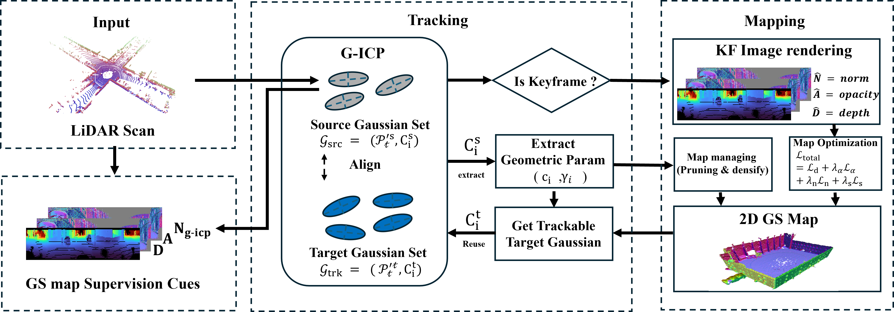

<div align="center">

<h2>Real-Time LiDAR Gaussian Splatting SLAM via Geometry-Aware Covariance Coupling</h2>

[**SeungJun Tak**](https://takseungjun.github.io/Taksume.github.io/)\* · [**Yewon Jeon**](https://yyonyy.github.io/)\* · [**Jaeik Hwang**](https://jaeik-hwang.github.io/) · [**Suk Min Hwang**](https://github.com/flyingKangaroo1) · [**Seongbo Ha**](https://riboha.github.io/) · **Hyeonwoo Yu**

<sub>(* Equal Contribution)</sub>

<h3 align="center">ECCV 2026</h3>

[Project_Page](https://lab-of-ai-and-robotics.github.io/GS-SLAM-Family/) | [arxiv]() | [Paper]() | [Video](https://youtu.be/NsbvDb8hZbA)

</div>

## Overview

<div align="center">

</div>

**System Overview.** We downsample each LiDAR scan and estimate per-point covariances to form a per-frame source point set. Tracking registers this source set to a trackable target set from the map via G-ICP to estimate the current pose, and the covariances produce a per-point control score for pruning/densification. Keyframes are fused into the 2D Gaussian map and optimized, while reusing stored target parameters avoids per-frame covariance re-estimation and improves robustness to geometric noise.

## Code

## Installation

This project is tested on Linux with CUDA-capable NVIDIA GPUs. Create a Python environment first, then install PyTorch for your CUDA version from the official PyTorch instructions.

```bash
conda create -n lidargs python=3.10 -y
conda activate lidargs
```

Install system packages:

```bash
sudo apt update
sudo apt install -y build-essential cmake ninja-build libeigen3-dev libpcl-dev
```

Clone the repository:

```bash
git clone <repo-url>
cd LiDAR-GS
```

Install Python dependencies:

```bash
pip install -r requirements.txt
```

Build local extensions:

```bash
bash install_submodules.sh
```

This installs the local CUDA rasterizer, `simple-knn`, the modified FastGICP binding, and the MapClosures pybind module.

## Supported Datasets

The current configs cover:

- KITTI Odometry: `configs/kitti.yaml`
- Newer College Dataset: `configs/ncd.yaml`
- Oxford Spires: `configs/oxpires_col.yaml`, `configs/oxpires_lib.yaml`, `configs/oxpires_obs.yaml`
- Generic point cloud sequences: see `configs/replica.yaml` as a template

Update `data.dataset_path`, point cloud paths, trajectory paths, and sensor intrinsics in the selected config before running.

Expected KITTI layout:

```text
<sequence>/
  velodyne/
    000000.bin
    ...
  times.txt
  pose.txt
  calib.txt
```

ROS bag datasets should set `cloud_format: rosbag`, `rosbag_topic`, and a TUM-format trajectory file in the config.

## Running SLAM

Run with a config file:

```bash
conda activate lidargs

python gs_icp_slam.py --config_file configs/kitti.yaml
```

Useful command-line overrides:

```bash
python gs_icp_slam.py \
  --config_file configs/kitti.yaml \
  --dataset_path /path/to/kitti/00 \
  --output_path output/kitti_00 \
  --loop_overlap_th 0.7 \
  --downsample_voxel_size 0.4
```

The system uses estimated GICP poses for tracking and mapping. Ground-truth trajectories are used only for evaluation and plotting.

## Outputs

After a normal run, the output directory contains:

- `metrics.json`: tracking/mapping FPS, ATE, final Gaussian count, and GPU usage
- `models/0000.ply`: optimized Gaussian map
- `mesh_ready_pcd.ply`: point cloud exported for meshing
- `graph.yaml`: pose graph
- `cfg.yaml`: reconstruction config for Splat-LOAM
- `summary.md`: experiment summary
- `est_traj_tum.txt`: estimated trajectory in TUM format
- `est_traj_kitti.txt`: estimated trajectory in KITTI format
- `est_traj_pts.txt`: estimated trajectory positions

Metrics are written only when the sequence finishes cleanly.

## Trajectory Evaluation

The repository writes estimated trajectories for `evo`. Example:

```bash
evo_ape kitti /path/to/gt_kitti.txt output/kitti_00/est_traj_kitti.txt --align --plot
```

For TUM-format trajectories:

```bash
evo_ape tum /path/to/gt_tum.txt output/ncd_result/est_traj_tum.txt --align --t_max_diff 0.03 --plot
```

## Reconstruction Evaluation

Use `eval_reconstruction.sh` after SLAM finishes. The script creates a mesh, aligns it to the GT frame using `evo_ape`, crops the GT map, and runs Splat-LOAM reconstruction evaluation.

KITTI-style trajectory:

```bash
bash eval_reconstruction.sh \
  --result-dir output/kitti_00 \
  --gt-traj /path/to/gt_kitti.txt \
  --gt-map /path/to/gt_map.ply \
  --traj-format kitti
```

TUM-style trajectory:

```bash
bash eval_reconstruction.sh \
  --result-dir output/ncd_result \
  --gt-traj /path/to/gt_tum.txt \
  --gt-map /path/to/gt_map.ply \
  --traj-format tum \
  --t-max-diff 0.03
```

The reconstruction evaluation produces:

- `mesh.ply`
- `mesh-gt-align.ply`
- `gt_crop.ply`
- `eval_recon.csv`
- `evo_ape_align.log`

## Configuration Notes

Important SLAM parameters live under the `slam` section of each YAML config:

- `max_correspondence_distance`: GICP correspondence distance
- `downsample_voxel_size`: voxel size before tracking
- `keyframe_freq`: forced keyframe interval
- `n_trackable_keyframes`: number of active keyframes for tracking
- `loop_overlap_th`: loop closure acceptance threshold
- `loop_constraint_noise`: PGO loop constraint noise
- `loop_cooldown_time`: minimum frame gap before another loop attempt
- `use_densify`: enables Gaussian densification

Loop closure is enabled by default. Current configs use `loop_overlap_th: 0.7`.

## Acknowledgements

This repository uses components from Gaussian Splatting, FastGICP, MapClosures, and Splat-LOAM for reconstruction evaluation.
